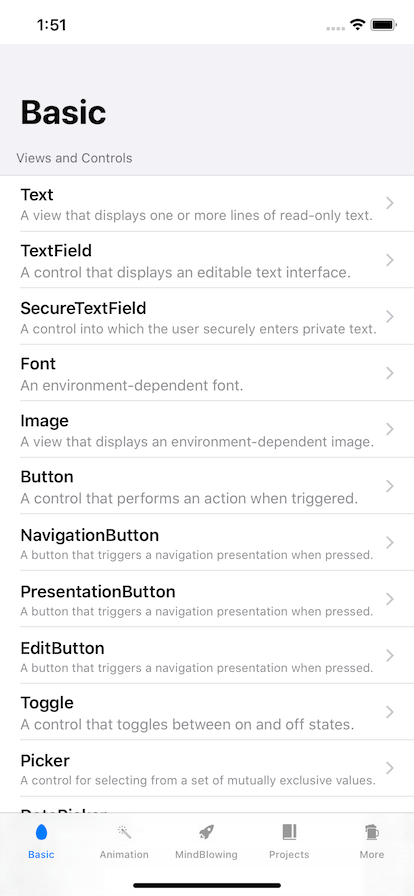

# SwiftUI MindBlowing 🤯

Collections of mind-blowing SwiftUI snippets and projects.

## Why another awesome-swiftui?

SwiftUI has come with a blast during and after WWDC 2019. The technology is so exciting so that the Swift Community has quickly come up with different tutorials, sample projects and experiments showing the potential of it.

Since I am a big fan of learning by doing and from the others, I create this app for my own learning and the app serves as my effort to contribute to the community, to consolidate as many tips & tricks from the community as possible, from basic to advanced SwiftUI usages, and also to showcase many cool 🤯 projects, experiments from other developers.

The app is organized in 5 main sections:

* **Basic:** showing how to use primitive elements SwiftUI.

* **Animation:** showing how to make basic animations with SwiftUI.
* **MindBlowing:** super cool, mind-blowing experiments from the community. 
* **Projects:** full-blown simple to advanced projects using SwiftUI (and Combine).
* **More:** some miscellaneous stuffs related to SwiftUI (SFSymbols, Tips & Tricks ...).

## Open and Community-driven

As SwiftUI is quite new and is still evolving very fast, I would welcome everyone to join me to make the app more useful to the community. PRs/New ideas are welcome. 

👉 Currently, I need some help to design a logo and a banner for the repo, if you have some basic design knowledge, please don't hesitate to contact me.

## Requirements

- macOS 15 Beta
- Xcode 11.0 Beta
- iOS 13.0 Betas

## License

I try to integrate only MIT license friendly code. The code are copyrighted by their respective authors. I always attach the links to the original repos alongside the code.

The app itself is also licensed under MIT license as stated in [LICENSE](LICENSE) 
